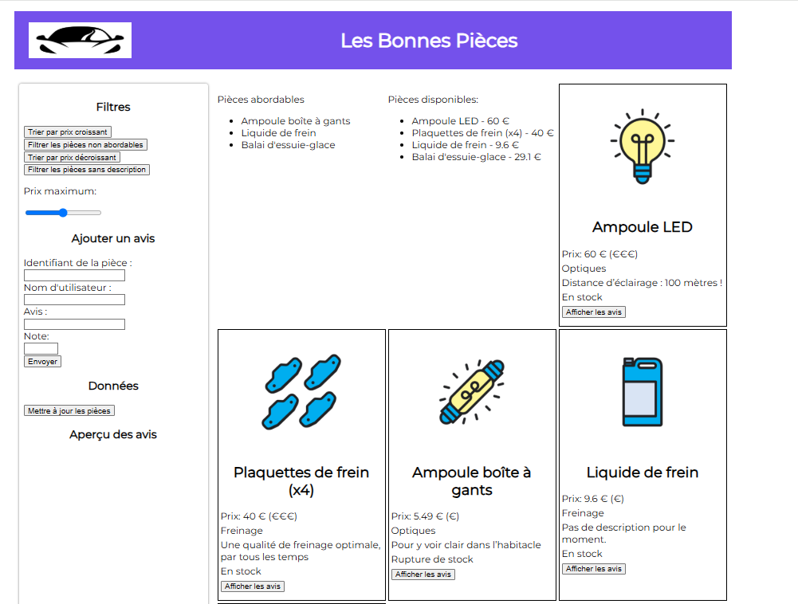

# 🚗 Les Bonnes Pièces – Interface web dynamique

Ce projet a été réalisé dans le cadre d’un exercice pratique consistant à créer une **interface web interactive** avec **JavaScript** pour Les Bonnes Pièces, un site spécialisé dans la vente de **pièces détachées automobiles**.

---

### 🎯 Objectif du projet

Créer une page web permettant :

* D’**afficher** les produits automobiles disponibles
* De **trier** et **filtrer** dynamiquement ces produits
* De **visualiser** les commentaires des utilisateurs
* De rendre l’interface claire, fluide et réactive en JavaScript

---

## 📸 Aperçu

---

### 🧰 Technologies utilisées

* **HTML5** : structure de la page
* **CSS3** : mise en forme
* **JavaScript** : interactions, manipulation du DOM, tri/filtrage

---

### 📦 Fonctionnalités

* Affichage des **produits**
* Tri **alphabétique**, **par prix**, **par pertinence**
* Affichage des **commentaires clients**
* Interface fluide, entièrement dynamique sans rechargement de page

---

## 🎓 Objectifs pédagogiques

* ✅ Créer une **interface web** à partir de **données JSON existantes**
* ✅ Rendre la page **interactive** grâce à **JavaScript**
* ✅ Utiliser **fetch()** pour interagir avec une **API HTTP locale**
* ✅ Utiliser des **librairies JavaScript** pour enrichir l’expérience utilisateur

---

## 🔧 Technologies utilisées

* **HTML5 / CSS3**
* **JavaScript Vanilla**
* **Fetch API** pour les requêtes HTTP
* **Manipulation du DOM**

---

## 🚀 Comment exécuter le projet
- Ouvrez le dossier du projet dans Visual Studio Code
- Installez l'extension "Live Server" (si ce n’est pas déjà fait) :
- Faites clic droit sur index.html
- Cliquez sur "Open with Live Server"